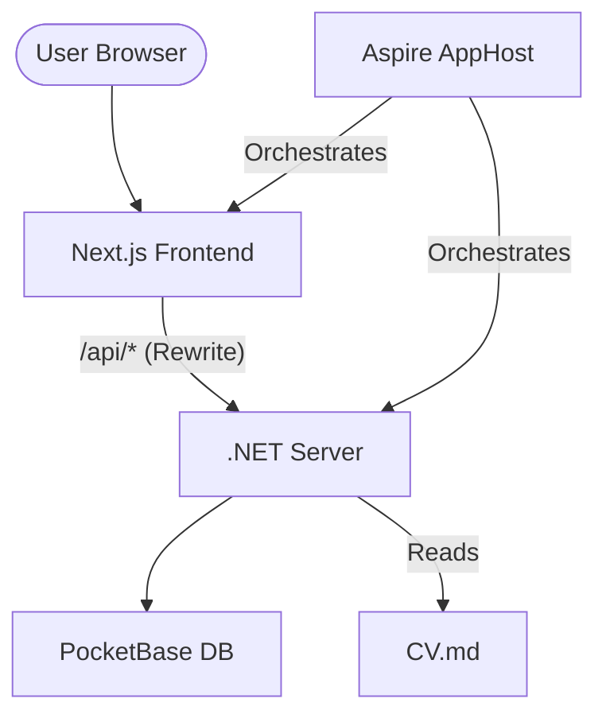

# Architecture

## System Overview
The HieuNinhCV project follows a **Distributed Application** architecture orchestrated by .NET Aspire, implementing a **Backend-for-Frontend (BFF)** pattern.

## Internal Patterns

### Backend-for-Frontend (BFF)
Next.js acts as the primary entry point for the user, providing SSR and hydration. It proxies business logic and data requests to the .NET Server, which serves as the "true" backend.

### Orchestration Layer
The `AppHost` project defines the relationship between services. It ensures the backend is healthy before the frontend starts and provides a unified dashboard for logs and telemetry.

### Data Synchronization (Sidecar Seeder)
The system treats `CV.md` as the "Source of Truth" for profile data. A seeder component in the Server project parses this Markdown file and upserts the data into PocketBase on startup or via a specific trigger.

### Minimalism & Performance
- **Minimal APIs**: The backend uses ASP.NET Core Minimal APIs for low overhead.
- **Client-Side Data Fetching**: `PortfolioSection` uses React `useEffect` to fetch data asynchronously, keeping the initial page load fast while loading dynamic sections in the background.
